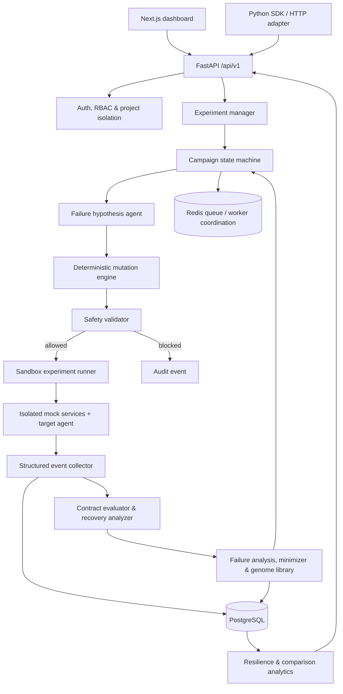
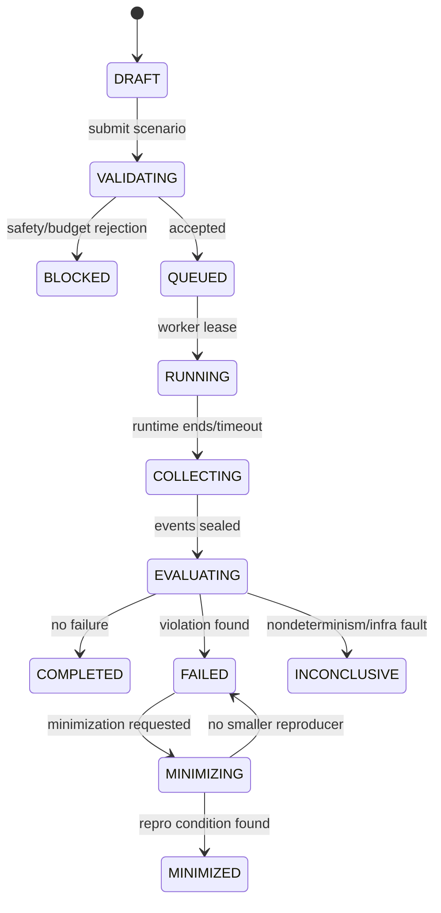

# System architecture

## Product boundary

ChaosForge tests agent behavior by altering only a controlled environment. It does not inspect hidden chain-of-thought, execute arbitrary shell commands, or send generated experiments to production systems. The platform is responsible for proposing, validating, running, evaluating, and preserving reproducible experiments; the target agent remains a replaceable runtime adapter.

## Component diagram



## Responsibilities and ownership

| Component | Responsibility | Must not do |
|---|---|---|
| API and auth | Validate user input, enforce API keys/RBAC/project ownership, publish the external contract. | Directly run an unvalidated scenario. |
| Agent registry | Store versioned agent contract, endpoint/adapter configuration, tool allowlist, model metadata. | Treat an unversioned agent as reproducible. |
| Campaign orchestrator | Maintain bounded discovery/regression/hardening/benchmark state; choose the next candidate. | Bypass budget or safety gate. |
| Hypothesis agent | Rank controlled hypotheses using capabilities, tool graph, prior outcomes, novelty, and predicted impact. | Access target infrastructure or execute experiments. |
| Mutation engine | Convert an approved parent genome into seeded, typed scenario variants. | Produce arbitrary instructions or untyped payloads. |
| Safety validator | Reject unsafe targets, unallowlisted tools, external networking, destructive operations, and budget violations. | Repair unsafe requests silently. |
| Sandbox runner | Build an isolated, version-pinned environment and invoke the adapter with timeout/resource limits. | Mount host secrets/filesystem or production credentials. |
| Event collector | Append redacted, ordered observable events. | Record chain-of-thought or raw secrets. |
| Evaluator | Apply contract-derived observable policy checks and behavior classification. | Infer unobserved intent. |
| Minimizer | Find a minimum reproducing subset of an observed failure under fixed seed and runtime versions. | Change the target agent/configuration while minimizing. |
| Analytics | Derive scores, MFC, failure surface, and version comparisons from completed experiments only. | Invent values for unexecuted work. |

## Runtime boundaries

1. **Control plane:** UI, API, identity, campaign configuration, and analytics. It never holds production target credentials.
2. **Execution plane:** disposable sandbox workers running reference/mock services and an adapter. It uses a deny-by-default network policy.
3. **Data plane:** PostgreSQL for durable relational evidence and object storage for bounded artifacts; Redis only schedules work and holds no source-of-truth state.

## Experiment lifecycle



`BLOCKED`, `COMPLETED`, `INCONCLUSIVE`, and `MINIMIZED` are terminal. `FAILED` is terminal for the original experiment but may parent a separate minimization run. Events are append-only after `COLLECTING`; derived evaluation records are versioned rather than overwritten.

## Reproducibility envelope

Each execution persists agent version and image/reference, adapter version, environment version, scenario schema/version and canonical JSON, seed, model/provider configuration, prompt/tool-definition versions, ChaosForge version, evaluator version, and execution limits. A replay uses that envelope. An outcome marked `INCONCLUSIVE` must state which envelope component could not be reproduced.

## Repository structure (target state)

```text
chaosforge/
├── apps/
│   ├── api/                 # FastAPI control-plane API
│   └── web/                 # Next.js dashboard
├── packages/
│   └── sdk/                 # Python client, instrumentation, optional adapters
├── engine/
│   ├── orchestrator/        # Campaign state machine and budgets
│   ├── hypotheses/          # Advisory ranking only
│   ├── mutations/           # Seeded typed generators
│   ├── minimizer/           # Delta-debugging executor
│   ├── evaluator/           # Policy, classification, root-cause evidence
│   ├── scoring/             # Scores/MFC/failure surface
│   └── safety/              # Scenario and runtime validation
├── agents/
│   ├── adversary/           # Advisory hypothesis strategy
│   └── examples/            # Deterministic support agents v1/v2
├── sandbox/
│   ├── payment-service/
│   ├── customer-service/
│   └── notification-service/
├── database/migrations/
├── benchmarks/
├── tests/
│   ├── unit/
│   ├── integration/
│   ├── e2e/
│   └── security/
├── docs/
├── docker-compose.yml
├── .env.example
└── README.md
```

The present repository intentionally contains only `README.md` and `docs/` from this target layout.
