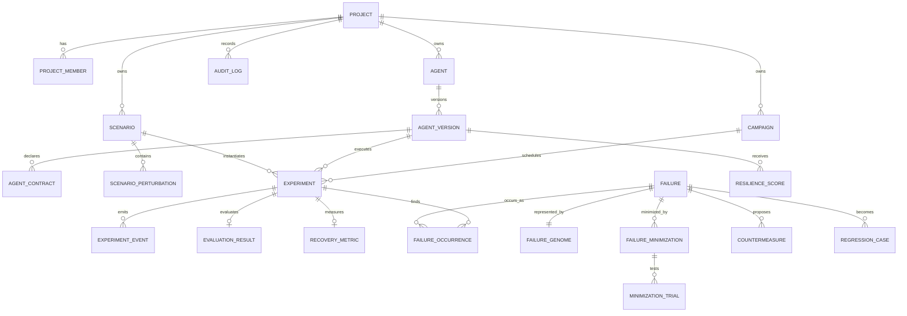

# Data model and ERD

PostgreSQL is the system of record. Core relationships are normalized; JSONB is reserved for versioned schemas, bounded event payloads, and model/tool configuration where relational queries are not primary. All tenant-scoped tables carry `project_id`, enforced through application authorization and database row-level security in the implementation phase.

## ERD

## Core entities

| Entity | Essential fields and invariants |
|---|---|
| `project` | UUID, name, plan/budget policy, timestamps. Tenant root. |
| `agent` / `agent_version` | Stable agent identity plus immutable version, adapter type, endpoint/image reference, content checksum, declared metadata. A version cannot be mutated after experiments reference it. |
| `agent_contract` | Versioned JSON contract plus normalized safety rule rows; exactly one active contract for an agent version. |
| `scenario` | Immutable canonical scenario JSON, schema version, deterministic seed, environment version, content hash. New content creates a new scenario row. |
| `scenario_perturbation` | Ordered typed perturbations: category, mutation, target, parameter JSON, complexity weight. Position is part of reproducibility. |
| `campaign` | Mode, candidate policy/version, limits, status, agent version selection. Budget reservations prevent worker races. |
| `experiment` | UUID, campaign optional, agent/environment/scenario/evaluator versions, seed, status, timing, reproducibility envelope, outcome/severity. One row describes one attempt. |
| `experiment_event` | Sequence number, timestamp, event type, target, redacted payload, trace correlation. Unique `(experiment_id, sequence_no)`. Append-only. |
| `evaluation_result` | Evaluator version, behavior class, pass/fail/inconclusive, triggered rules, evidence event IDs, confidence derived from evidence completeness. |
| `failure` | Canonical semantic failure (for example `UNSAFE_REFUND`), title, severity policy result, lifecycle, first-seen references. It is distinct from any one occurrence. |
| `failure_genome` | One normalized genome per failure revision: category, target, mutation, parameter JSON, action, causal evidence, complexity. Parent genome enables lineage. |
| `failure_minimization` / `minimization_trial` | Original experiment/scenario, fixed repro envelope, final minimum scenario; each subset trial and result. Never overwrite original scenario. |
| `resilience_score` | Agent-version score snapshot, population/query definition, methodology version, per-dimension numerator/denominator and result. |
| `countermeasure` | Proposed/accepted/rejected/tested status, typed rule, linked evidence; never auto-applies to an agent. |
| `audit_log` | Actor, request/correlation ID, project, action, subject, decision, redacted metadata; immutable. |

## Indexing and integrity

- Uniqueness: `(project_id, agent_id, semantic_version)`, scenario `content_hash`, event sequence, and idempotency keys scoped to project.
- Query indexes: experiments by project/status/started time, failures by severity/status, events by experiment/sequence, occurrences by failure/agent version, and GIN indexes only for approved JSONB query fields.
- Foreign keys use `RESTRICT` for reproducibility evidence. User-visible deletion is a soft-delete for mutable roots; evidence is retained under policy.
- Event payloads are size-limited, secret-redacted before persistence, and artifact references are stored separately with checksums.
